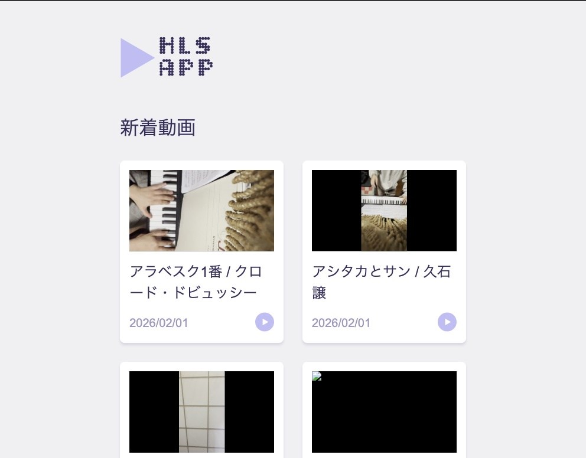

## 概要
- HLSの視聴が可能なサーバー群を、ローカルのコンテナ上に構築する

### 表示サンプル

|動画一覧画面 |動画詳細画面 |
|---|---|
| | |

### 構成
技術選定の詳細は [ADR](Docs/ADR/README.md) を参照

- HLSの視聴が可能なサーバー群は以下のコンテナで構成される
    - [api](api/README.md)
        - streaming サーバーに配置された動画一覧、動画情報詳細を返却するAPIサーバー
    - [front](front/README.md)
        - HLSを視聴するためのフロントエンドのファイルを格納するWebサーバー
    - [streaming](streaming/README.md)
        - 動画コンテンツ、サムネイルを格納するWebサーバー
    - [database](database/README.md)
        - 動画情報を格納するデータベースサーバー
- サーバー証明書の更新は以下のコンテナで自動的に行う
    - [certbot](certbot/README.md)

## Dependencies

- [Podman](https://podman.io/)
    - (必須) compose コマンドが使えるようにセットアップが必要

## Usage

1. [事前準備](./certbot/README.md#事前準備) を参照し、自ドメインと Cloudflare APIのトークンを用意する

1. 環境変数として各コンテナで参照するため、プロジェクトルートに `.env` ファイルを作成し以下の項目を記載する

    ```env
    ## Certificate
    DOMAIN_NAME=<取得したドメイン名>
    EMAIL_ADDRESS=<ドメインを取得したメールアドレス>

    ## Domains
    REVERSE_PROXY_DOMAIN_NAME=<リバースプロキシサーバのドメイン名>
    API_DOMAIN_NAME=<APIサーバのドメイン名>
    STREAMING_DOMAIN_NAME=<ストリームサーバのドメイン名>
    FRONT_DOMAIN_NAME=<フロントサーバのドメイン名>
    ```

1. [DBの環境変数の設定](./database/README.md#環境変数の設定) を参照し、プロジェクトルートの .env ファイルに DB 用の環境変数を定義する

1. [Prepare m3u8 playlist](./streaming/README.md#prepare-m3u8-playlist) を参照し、配信用の動画ファイルを用意する

1. ドメイン名で名前解決するため、下記の設定を `/etc/hots` に追加する

    ```console
    127.0.0.1 <リバースプロキシサーバのドメイン名>
    127.0.0.1 <フロントサーバのドメイン名>
    127.0.0.1 <ストリームサーバのドメイン名>
    127.0.0.1 <APIサーバのドメイン名>
    ```

1. Podmanでホスト側の53番以上のポートを利用できるよう設定を変更する

    ```console
    ## Podman の VM に ssh 接続
    $ podman machine ssh
    Connecting to vm podman-machine-default. To close connection, use `~.` or `exit`
    Fedora CoreOS 43.20251110.3.1
    Tracker: https://github.com/coreos/fedora-coreos-tracker
    Discuss: https://discussion.fedoraproject.org/tag/coreos

    ## 53番以上のポートを使用可能にする
    $ sudo sysctl -w net.ipv4.ip_unprivileged_port_start=53
    net.ipv4.ip_unprivileged_port_start = 53
    ```

1. compose 経由でコンテナイメージをビルド、起動する

    ```console
    $ podman compose up -d --build
    ```

1. ホストマシンからドメイン名で各種サーバーへアクセスできる🎉

    - Web ブラウザからfrontサーバーのindex.htmlへアクセス
        - `https://${.env.FRONT_DOMAIN_NAME}`
    - Web ブラウザからリバースプロキシのindex.htmlへアクセス
        - `https://${.env.REVERSE_PROXY_DOMAIN_NAME}`
    - Web ブラウザからAPIサーバーへアクセス
        - `https://${.env.API_DOMAIN_NAME}/PATH_TO_API`
